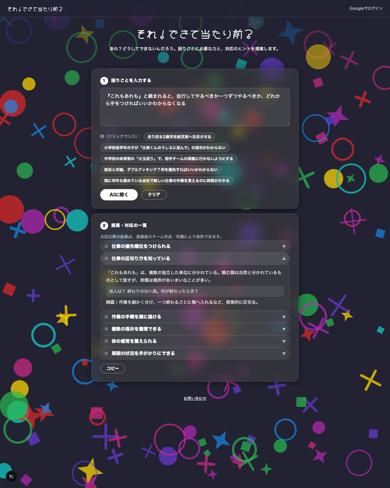

# それ！できて当たり前？

「できて当たり前」とされる行動・指示を、要素と必要な能力に分解し、対応を提案するWebアプリです。
分解の矛先は人ではなく困りごと。診断ではなく、困りごとの要素分解図です。

## デプロイURL
https://soreata.vercel.app/

## 画面イメージ


## 主な機能
- 困りごとをAIに入力すると、必要な力・対応のヒントを提案
- チームを作成し、協力者（保護者・先生など）を招待
- 提案結果をチームの記録として保存し、能力ごとの確認日を管理
- Slack・Discordへのワンボタン投稿

## 理念
「できる」の裏には複数の力が働いていて、「できて当たり前」とされるものほど、その存在に気づきにくくなります。
指示・行動を、必要な力に分けて見る作業は、専門的な訓練を要する技術です。
soreata は、その「掘る目」を周囲の人や本人に提供する道具です。
対応の出発点は、行動の評価ではなく「どんな力が必要か」を見つけることにあり、自分の苦手部分も確認できます。
能力があるかどうかは、本人や家族の意欲・努力・関わり方とは無関係です。

## 技術スタック
- Next.js（App Router・TypeScript）
- Supabase（Postgres・Auth・Row Level Security）
- Gemini API（AI提案生成）
- Vercelでホスティング

## セットアップ
1. 依存関係をインストール
   ```
   npm install
   ```
2. `.env.example`を`.env.local`にコピーし、値を設定する
   ```
   cp .env.example .env.local
   ```
3. 開発サーバーを起動
   ```
   npm run dev
   ```

## ドキュメント
- 確定仕様：`docs/SPEC.md`
- データ構造：`docs/data_structure.md`（ER図：`docs/data_structure_diagram.md`）
- 画面構成：`docs/screen_tree.md`
- ディレクトリ構成：`docs/directory_structure.md`

## ライセンス
本リポジトリは学内の課題提出のため、一定期間公開しています。
ライセンスは付与していないため、コードの再利用・改変・再配布・商用利用はできません。