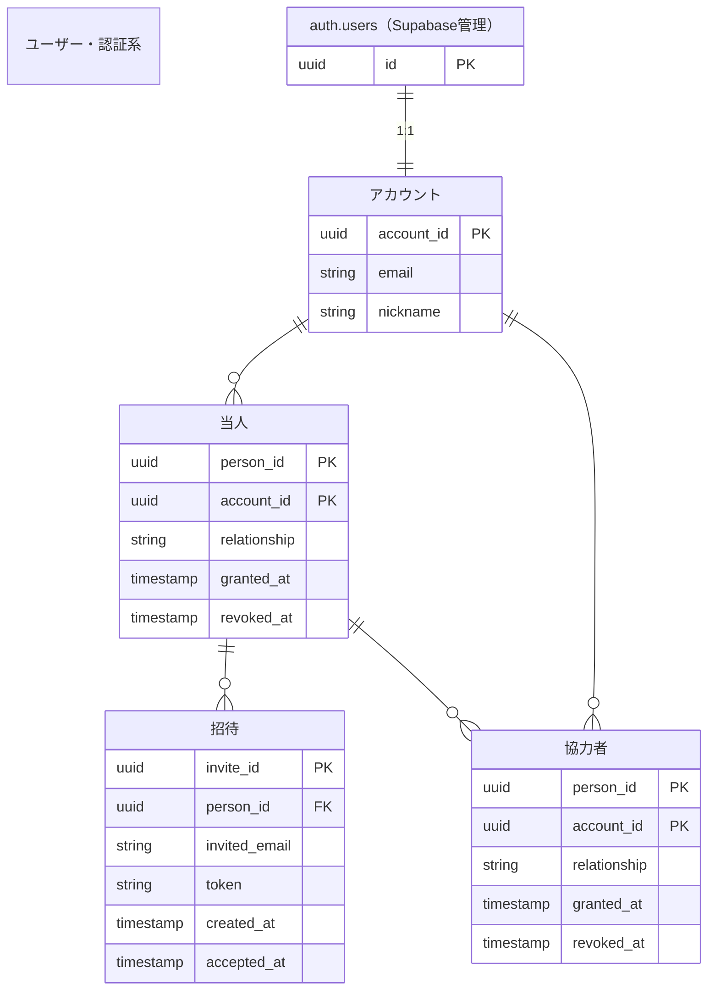
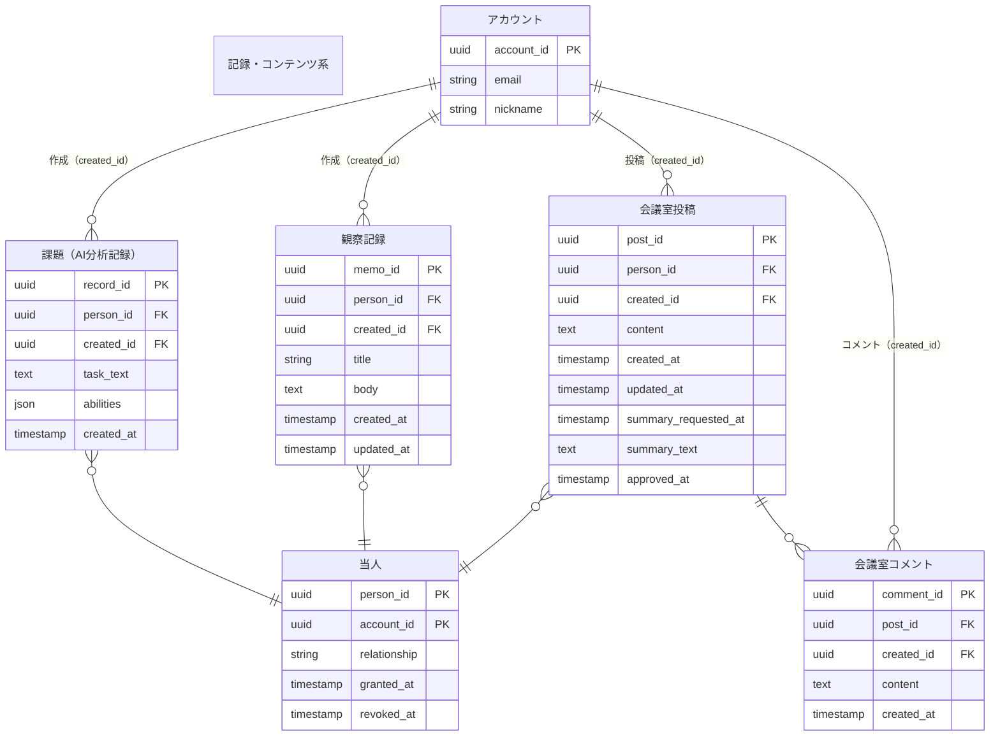

## 図1：ユーザー・認証系

```mermaid
erDiagram
    ユーザー・認証系
    AUTH_USERS["auth.users（Supabase管理）"] {
        uuid id PK
    }
    ACCOUNTS["アカウント"] {
        uuid account_id PK
        string email
        string nickname
    }
    PERSONS["当人"] {
        uuid person_id PK
        uuid account_id PK
        string relationship
        timestamp granted_at
        timestamp revoked_at
    }
    INVITATIONS["招待"] {
        uuid invite_id PK
        uuid person_id FK
        string invited_email
        string token
        timestamp created_at
        timestamp accepted_at
    }
    COLLABORATORS["協力者"] {
        uuid person_id PK
        uuid account_id PK
        string relationship
        timestamp granted_at
        timestamp revoked_at
    }
    AUTH_USERS ||--|| ACCOUNTS : "1:1"
    ACCOUNTS ||--o{ PERSONS : ""
    PERSONS ||--o{ INVITATIONS : ""
    PERSONS ||--o{ COLLABORATORS : ""
    ACCOUNTS ||--o{ COLLABORATORS : ""


```

---

## 図2：記録・コンテンツ系

```mermaid
erDiagram
    記録・コンテンツ系
    ACCOUNTS["アカウント"] {
        uuid account_id PK
        string email
        string nickname
    }
    PERSONS["当人"] {
        uuid person_id PK
        uuid account_id PK
        string relationship
        timestamp granted_at
        timestamp revoked_at
    }
    RECORDS["課題（AI分析記録）"] {
        uuid record_id PK
        uuid person_id FK
        uuid created_id FK
        text task_text
        json abilities
        timestamp created_at
    }
    MEMOS["観察記録"] {
        uuid memo_id PK
        uuid person_id FK
        uuid created_id FK
        string title
        text body
        timestamp created_at
        timestamp updated_at
    }
    POSTS["会議室投稿"] {
        uuid post_id PK
        uuid person_id FK
        uuid created_id FK
        text content
        timestamp created_at
        timestamp updated_at
        timestamp summary_requested_at
        text summary_text
        timestamp approved_at
    }
    COMMENTS["会議室コメント"] {
        uuid comment_id PK
        uuid post_id FK
        uuid created_id FK
        text content
        timestamp created_at
    }

    RECORDS }o--|| PERSONS : ""
    MEMOS }o--|| PERSONS : ""
    POSTS }o--|| PERSONS : ""
    POSTS ||--o{ COMMENTS : ""
    ACCOUNTS ||--o{ RECORDS : "作成（created_id）"
    ACCOUNTS ||--o{ MEMOS : "作成（created_id）"
    ACCOUNTS ||--o{ POSTS : "投稿（created_id）"
    ACCOUNTS ||--o{ COMMENTS : "コメント（created_id）"
```
