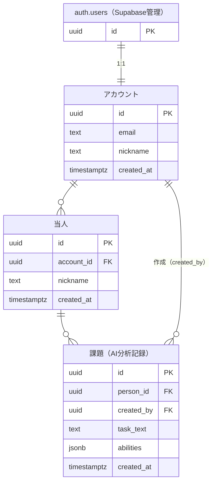
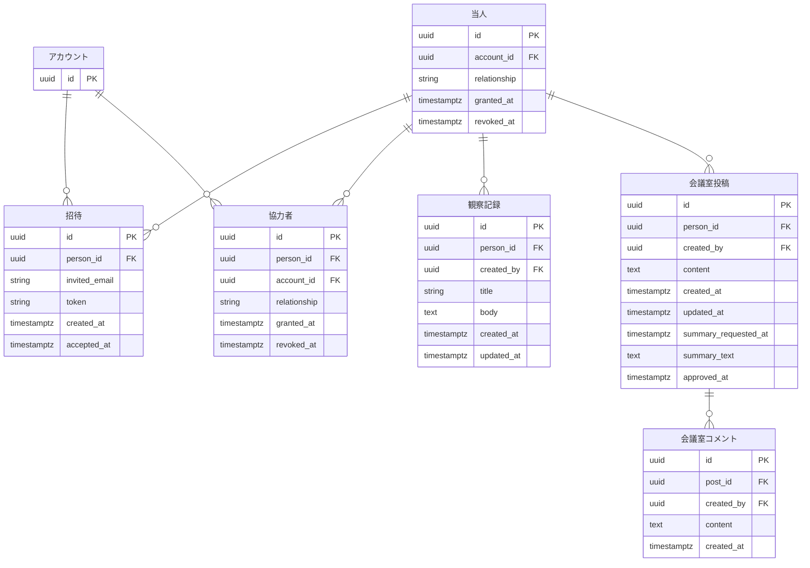

## v1 テーブル構成（実装済み）



### RLS ポリシー（v1）

| テーブル | ポリシー名 | 操作 | 条件 |
|---|---|---|---|
| accounts | accounts_select_own | SELECT | auth.uid() = id |
| accounts | accounts_insert_own | INSERT | auth.uid() = id |
| accounts | accounts_update_own | UPDATE | auth.uid() = id |
| accounts | accounts_delete_own | DELETE | auth.uid() = id |
| persons | persons_select_own | SELECT | auth.uid() = account_id |
| persons | persons_insert_own | INSERT | auth.uid() = account_id |
| persons | persons_update_own | UPDATE | auth.uid() = account_id |
| persons | persons_delete_own | DELETE | auth.uid() = account_id |
| decompositions | decompositions_select_own | SELECT | auth.uid() = created_by |
| decompositions | decompositions_insert_own | INSERT | auth.uid() = created_by |
| decompositions | decompositions_update_own | UPDATE | auth.uid() = created_by |
| decompositions | decompositions_delete_own | DELETE | auth.uid() = created_by |

---

## v2 追加予定テーブル



### v2 persons への追加カラム
personsテーブルに以下を ALTER TABLE で追加する：
- `relationship`：当人との関係（親・先生など）
- `granted_at`：登録日時
- `revoked_at`：解除日時（NULL = 現在有効）

### v2 RLS ポリシー
v2 では協力者が decompositions の confirmed_at を更新できる。
ポリシーは v2 実装時に改めて設計する。

---

### abilities JSON スキーマ

```json
[
  {
    "title": "能力タイトル",
    "description": "説明文",
    "person": "当人は？（体験の記述）",
    "solution": "対応",
    "confirmed_at": null
  }
]
```

- AI分析の出力をそのまま全フィールド保存する
- `confirmed_at`：能力確認日。未確認は `null`、確認後は `"YYYY-MM-DD"`
- 集計が必要になったら別テーブルに移行する

---

### テーブル設計の方針
- accounts.id は auth.users.id と同じ UUID。RLS で auth.uid() = id として使う。
- abilities JSON に AI分析の全フィールド（title・description・person・solution）と confirmed_at を保存する。集計が必要になったら別テーブルに移行。
- AI分析記録は編集不可。能力確認日のみ後から更新可。
- 状況メモ（task_memo）は持たない。観察記録で代替する。
