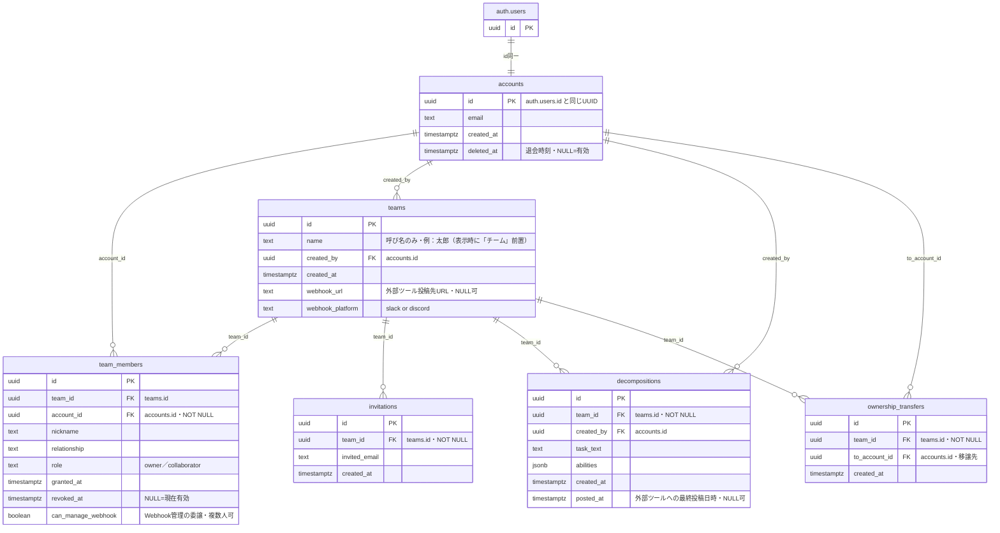

# データ構造図（ER図）

`docs/data_structure.md` の内容を mermaid の ER図として可視化したもの。
正（ソース・オブ・トゥルース）は常に `data_structure.md`。
`data_structure.md` のテーブル定義・RLSを変更した場合は、この図も追随して更新する。

## 凡例

- 確定テーブル：auth.users・accounts・teams・team_members・decompositions・invitations・ownership_transfers
- 観察記録（memos）・会議室（posts・comments）はsoreataの範囲外と確定したため図から削除（`docs/NOTES.md`「コミュニケーション機能をsoreataの範囲外にする」参照）
