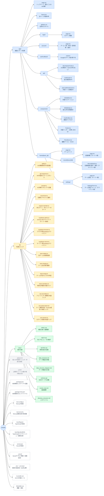

soreata全体のファイル構成。`.DS_Store`（macOSのゴミファイル）・`node_modules`・`.git`・`.next`（自動生成の依存関係）は対象外。
`gitignores/`は個人の作業用フォルダのため中身は省略する。

```mermaid
graph LR
    classDef appStyle fill:#dbeafe,stroke:#3b82f6,color:#1e3a5f
    classDef libStyle fill:#fef3c7,stroke:#f59e0b,color:#78350f
    classDef docsStyle fill:#dcfce7,stroke:#22c55e,color:#14532d
    classDef otherStyle fill:#ffffff,stroke:#9ca3af,color:#374151
    classDef ignoredStyle fill:#f3f4f6,stroke:#9ca3af,color:#6b7280,stroke-dasharray: 4 3

    ROOT((soreata))

    ROOT --> APP["app/\n画面とサーバ処理"]
    APP --> APP_PAGE["page.tsx\nトップページ（困りごとのAI分解）"]
    APP --> APP_LAYOUT["layout.tsx\n全ページ共通の枠"]
    APP --> APP_CSS["globals.css\n全体のスタイル"]
    APP --> APP_LOGIN["login/"]
    APP_LOGIN --> LOGIN_PAGE["page.tsx\nログイン画面"]
    APP --> APP_ACCOUNT["account/"]
    APP_ACCOUNT --> ACCOUNT_PAGE["page.tsx\nチーム一覧（作成・招待受諾・退会）"]
    APP --> APP_AUTH["auth/callback/"]
    APP_AUTH --> AUTH_ROUTE["route.ts\nGoogleログイン後の戻り先"]
    APP --> APP_API["api/"]
    APP_API --> API_DECOMPOSE["decompose/route.ts\nAI分解API（Gemini呼び出し）"]
    APP_API --> API_INVITE["invite/route.ts\n協力者招待API"]
    APP_API --> API_WEBHOOK["post-webhook/route.ts\n外部ツール投稿API"]
    APP --> APP_COMPONENTS["components/"]
    APP_COMPONENTS --> COMP_NAV["GlobalNav.tsx\n共通ナビゲーション"]
    APP_COMPONENTS --> COMP_ABILITY["AbilityBody.tsx\n能力1件の詳細表示"]
    APP_COMPONENTS --> COMP_CONFIRM["ConfirmBox.tsx\n確認ダイアログ"]
    APP_COMPONENTS --> COMP_FOOTER["Footer.tsx\n共通フッター（お問い合わせ）"]
    APP_COMPONENTS --> COMP_PENCIL["PencilIcon.tsx\n編集アイコン（SVG）"]
    APP --> APP_HOME["home/[team_id]/"]
    APP_HOME --> TEAM_PAGE["page.tsx\nチームページ"]
    APP_HOME --> HOME_RECORD["record/[recordId]/"]
    HOME_RECORD --> RECORD_PAGE["page.tsx\n記録詳細（サーバー側）"]
    HOME_RECORD --> RECORD_DETAIL["RecordDetail.tsx\n記録詳細の表示・操作（クライアント側）"]
    APP_HOME --> HOME_SETTINGS["settings/"]
    HOME_SETTINGS --> SETTINGS_PAGE["page.tsx\nチーム設定（サーバー側）"]
    HOME_SETTINGS --> SETTINGS_FORM["SettingsForm.tsx\nチーム設定フォーム（クライアント側）"]

    ROOT --> LIB["lib/\n共通ロジック"]
    LIB --> LIB_ABILITY["ability.ts\nAI分解結果1件の型定義"]
    LIB --> LIB_APIRES["api-response.ts\nAPI共通のエラーレスポンス"]
    LIB --> LIB_PROMPT["prompt.ts\nAI分解のプロンプト定義"]
    LIB --> LIB_RECORDTEXT["record-text.ts\n記録をテキストに整形"]
    LIB --> LIB_REQUIREMEMBER["require-member.ts\n未ログイン・非メンバーのガード"]
    LIB --> LIB_SBADMIN["supabase-admin.ts\nservice-roleクライアント（サーバー専用）"]
    LIB --> LIB_SBBROWSER["supabase-browser.ts\nブラウザ用Supabaseクライアント"]
    LIB --> LIB_SBSERVER["supabase-server.ts\nサーバー用Supabaseクライアント"]
    LIB --> LIB_TEAMDELETE["team-delete.ts\n空チームの削除処理"]
    LIB --> LIB_TEAMDISPLAY["team-display.ts\nチーム名の表示整形"]
    LIB --> LIB_TEAMEMPTY["team-empty.ts\nチームが空かどうかの判定"]
    LIB --> LIB_TEAMMEMBERS["team-members.ts\n有効な所属の共通クエリ"]
    LIB --> LIB_USEACCORDION["use-accordion.ts\nアコーディオン開閉の共通フック"]
    LIB --> LIB_USEACTIVETEAM["use-active-team.tsx\nチーム確定判定（Context提供＋参照フック）"]
    LIB --> LIB_USESESSION["use-session.ts\nログイン状態の共通フック"]

    ROOT --> DOCS["docs/\n設計文書"]
    DOCS --> DOCS_SPEC["SPEC.md\n確定仕様（最重要）"]
    DOCS --> DOCS_NEXT["NEXT.md\n次にやること・引き継ぎ"]
    DOCS --> DOCS_NOTES["NOTES.md\n意思決定の記録"]
    DOCS --> DOCS_DATASTRUCT["data_structure.md\nデータ構造の詳細"]
    DOCS --> DOCS_DATADIAGRAM["data_structure_diagram.md\nデータ構造のER図"]
    DOCS --> DOCS_SCHEMA["schema.sql\nDBのテーブル定義"]
    DOCS --> DOCS_SCREENTREE["screen_tree.md\n画面遷移"]
    DOCS --> DOCS_DIRSTRUCT["directory_structure.md\nこのファイル"]

    ROOT --> GITIGNORES["gitignores/\n個人の作業用フォルダ（中身は省略）"]
    ROOT --> PUBLIC["public/\n公開用ファイルの置き場（現在は空）"]

    ROOT --> PKGJSON["package.json\n依存関係とスクリプト定義"]
    ROOT --> PKGLOCK["package-lock.json\n依存関係のロックファイル"]
    ROOT --> NEXTCONFIG["next.config.ts\nNext.jsの設定"]
    ROOT --> NEXTENVD["next-env.d.ts\nNext.js自動生成の型定義"]
    ROOT --> TSCONFIG["tsconfig.json\nTypeScriptの設定"]
    ROOT --> TSBUILDINFO["tsconfig.tsbuildinfo\nTypeScriptビルドキャッシュ（自動生成）"]
    ROOT --> VERCELJSON["vercel.json\nVercelの設定"]
    ROOT --> VERCELDIR[".vercel/\nVercelデプロイ関連（自動生成）"]
    ROOT --> ENVFILES[".env・.env.local\n秘密の設定値（Git非公開）"]
    ROOT --> CLAUDEMD["CLAUDE.md\nAIとの共通ルール"]
    ROOT --> READMEMD["README.md\n概要・理念"]

    class ROOT,APP,APP_PAGE,APP_LAYOUT,APP_CSS,APP_LOGIN,LOGIN_PAGE,APP_ACCOUNT,ACCOUNT_PAGE,APP_AUTH,AUTH_ROUTE,APP_API,API_DECOMPOSE,API_INVITE,API_WEBHOOK,APP_COMPONENTS,COMP_NAV,COMP_ABILITY,COMP_CONFIRM,COMP_FOOTER,COMP_PENCIL,APP_HOME,TEAM_PAGE,HOME_RECORD,RECORD_PAGE,RECORD_DETAIL,HOME_SETTINGS,SETTINGS_PAGE,SETTINGS_FORM appStyle
    class LIB,LIB_ABILITY,LIB_APIRES,LIB_PROMPT,LIB_RECORDTEXT,LIB_REQUIREMEMBER,LIB_SBADMIN,LIB_SBBROWSER,LIB_SBSERVER,LIB_TEAMDELETE,LIB_TEAMDISPLAY,LIB_TEAMEMPTY,LIB_TEAMMEMBERS,LIB_USEACCORDION,LIB_USEACTIVETEAM,LIB_USESESSION libStyle
    class DOCS,DOCS_SPEC,DOCS_NEXT,DOCS_NOTES,DOCS_DATASTRUCT,DOCS_DATADIAGRAM,DOCS_SCHEMA,DOCS_SCREENTREE,DOCS_DIRSTRUCT docsStyle
    class PKGJSON,PKGLOCK,NEXTCONFIG,NEXTENVD,TSCONFIG,TSBUILDINFO,VERCELJSON,VERCELDIR,ENVFILES,CLAUDEMD,READMEMD otherStyle
    class GITIGNORES,PUBLIC ignoredStyle
```
