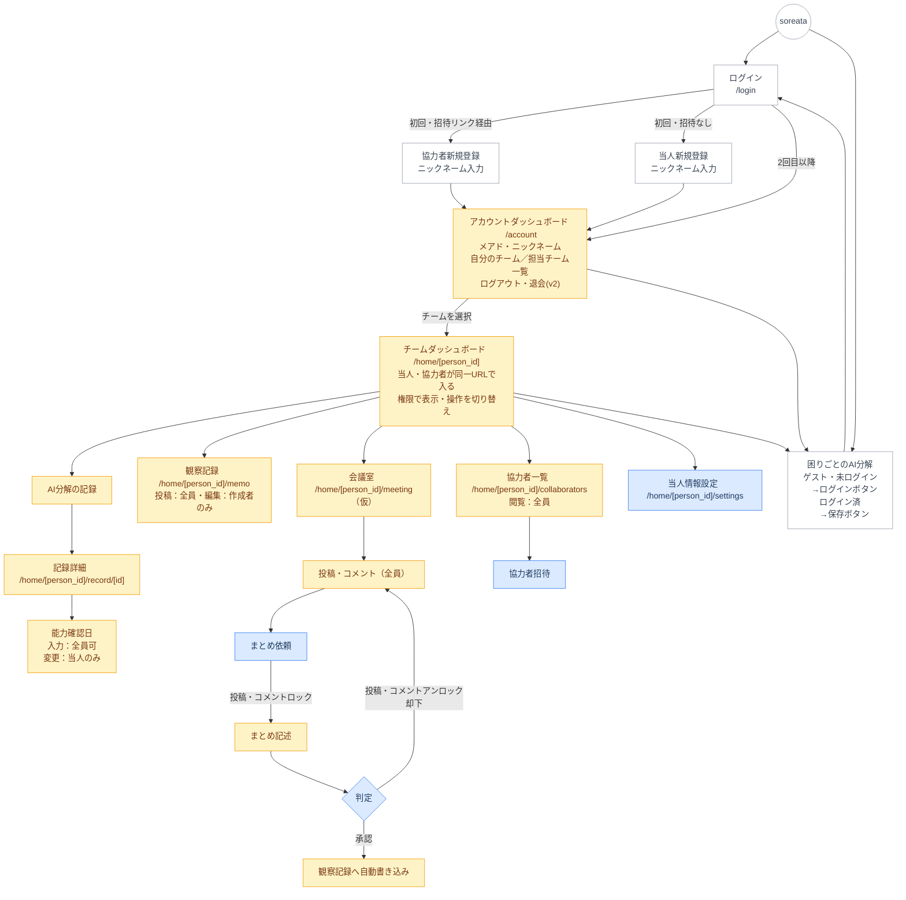

### 凡例
| 色 | 対象 |
|---|---|
| 白 | 全員（ゲスト含む） |
| 薄青 | 当人のみ |
| 薄黄 | 当人・協力者（ゲスト不可） |

---

### URL構成

**v1〜**
- `/`：困りごとのAI分解（ゲスト含む全員）
- `/login`：ログイン
- `/account`：アカウントダッシュボード
- `/home/[person_id]`：チームダッシュボード
- `/home/[person_id]/record/[id]`：AI分解記録詳細
- `/home/[person_id]/settings`：当人情報設定

**v2〜**
- `/home/[person_id]/memo`：観察記録
- `/home/[person_id]/meeting`：会議室（仮）
- `/home/[person_id]/collaborators`：協力者一覧
