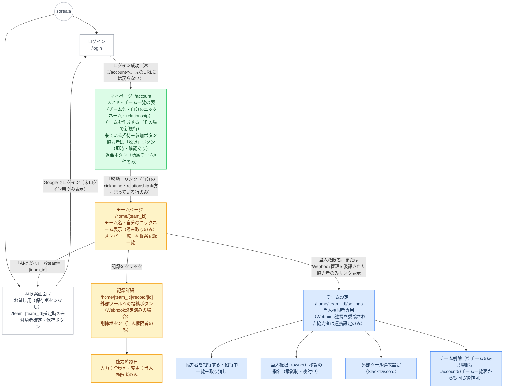

### 凡例
| 色 | 対象 |
|---|---|
| 白 | 全員（ゲスト含む） |
| 緑 | ログイン済みなら誰でも（チーム所属不問。0件のアカウントも含む） |
| 薄青 | 当人権限者のみ（Webhook連携設定は委譲された協力者も可） |
| 薄黄 | 当人権限者・協力者（自分のnickname・relationshipが埋まっている有効なメンバーのみ。ゲスト不可） |

---

### URL構成
- `/`：AI提案画面（ゲスト含む全員がアクセス可。保存はチームホーム発の`/?team=[team_id]`からのみ）
- `/login`：ログイン
- `/account`：マイページ（チーム一覧の表・チーム作成・招待受諾・脱退・退会。ログイン済みなら誰でも）
- `/home/[team_id]`：チームページ（「AI提案へ」で`/?team=[team_id]`へ）
- `/home/[team_id]/record/[id]`：AI提案記録詳細
- `/home/[team_id]/settings`：チーム設定（削除・招待・owner移譲・Webhook連携。チーム名編集は`/account`のチーム一覧表で行う）
