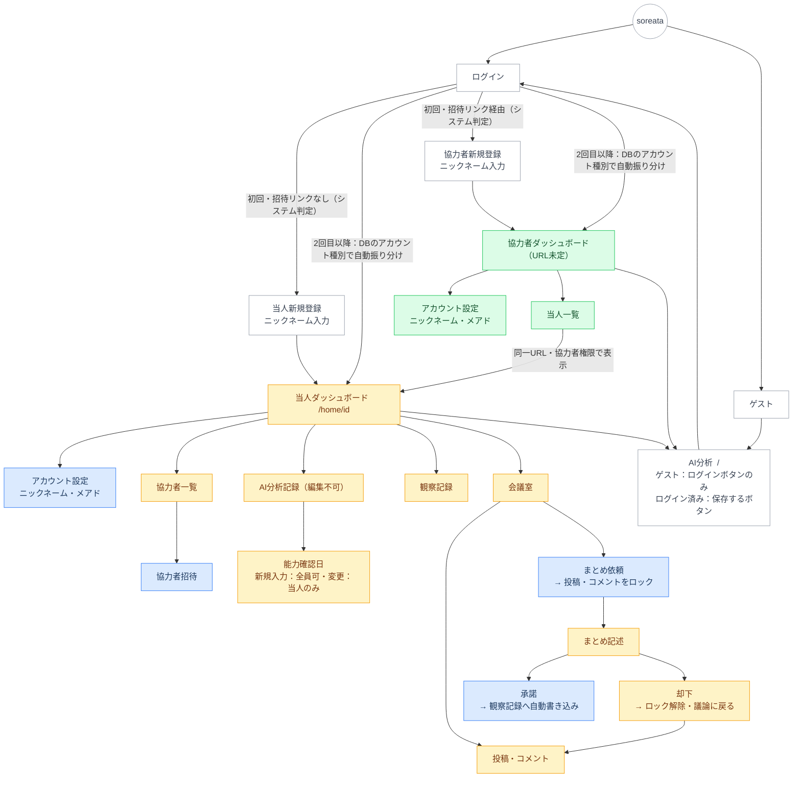

### 凡例
| 色 | 対象 |
|---|---|
| 白 | 全員（ゲスト含む） |
| 薄青 | 当人のみ |
| 薄緑 | 協力者のみ |
| 薄黄 | 当人・協力者（ゲスト不可） |

---

### URL構成

**v1（当人のみ）**
- `/`：AI分析（ゲスト含む全員）
- `/home/[id]`：当人ダッシュボード
- `/home/[id]/record/[id]`：AI分析記録詳細

**v2以降**
- `/home/[id]/memo`：観察記録タイムライン
- `/home/[id]/meeting`：会議室（仮）
- `/home/[id]/collaborators`：協力者一覧
- 協力者ダッシュボード：URL未定
